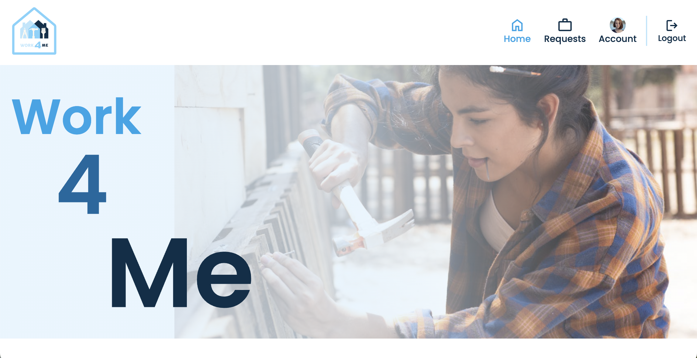
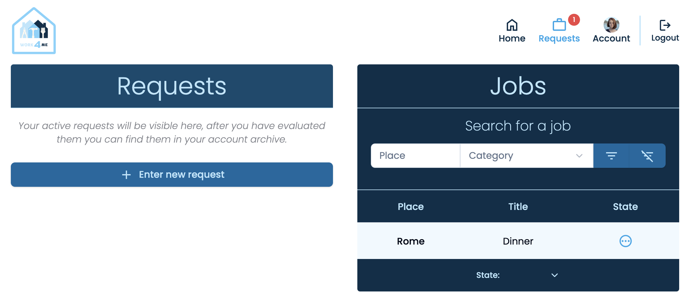
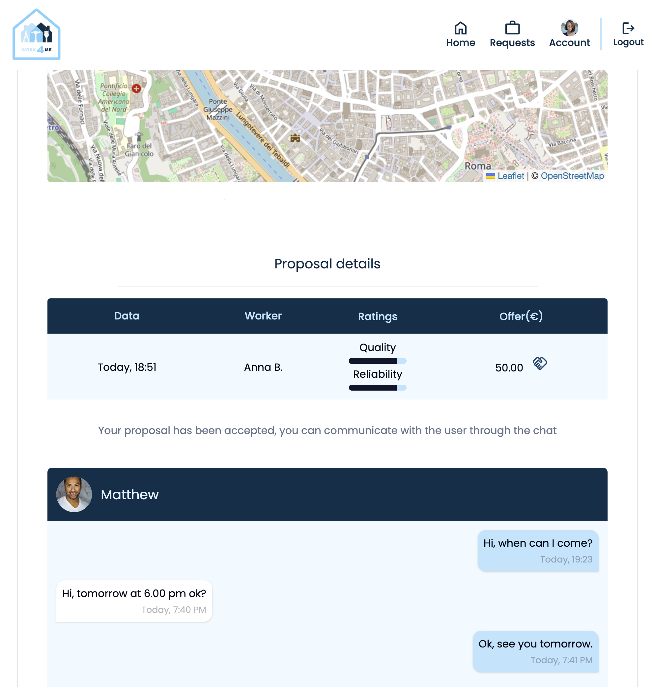
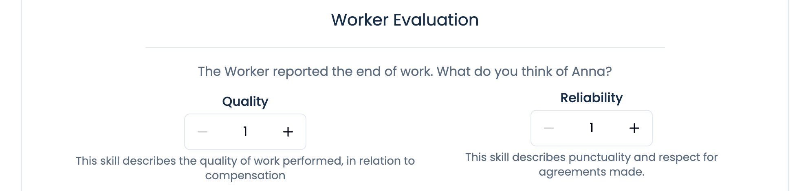
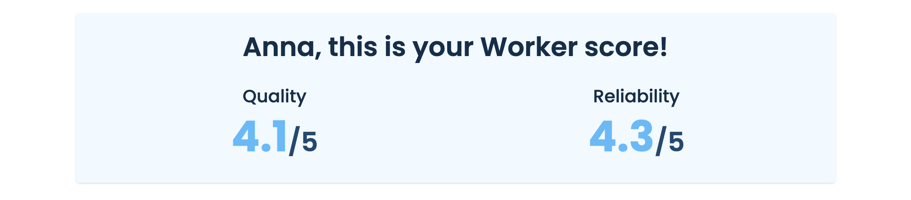

# Work 4 Me


## Description

This full stack project represents a platform that connects those who need to do work at home with those who are able to do that work, with the aim of doing good both to those who give and those who receive help. It was developed with Vue.js in Typescript for front end, and with Node.js and MongoDB for back end.



## Installation

If you're using OS X or Windows, use one of the installers from the
 [Node.js download page](https://nodejs.org/en/download/). LTS versions of
  Node.js are recommended.

Clone Github repo:

```bash
git clone https://github.com/Gio-Mex/work-4-me.git
```

Install package:

```bash
npm install
```

Run dev server:

```bash
node src/backEnd/index.js
```

Run dev build:
```bash
npm run dev
```

Navigate to http://localhost:5173

## Usage 
To use the platform you must first create an account (please use dummy data).  
In your account you can choose whether to be only a user of the platform or also a Worker, indicating your skills.
On the requests page you will see your job requests, and if you are a Worker also those of other users that match your skills.  
To insert a new job request go to the requests page and click on the appropriate button.



Workers who have a skill that matches the category of that request will be able to see it in their list of jobs and by opening it they will be able to read its details, including a map indicating the approximate area where the user who made the request lives: here the worker can make a proposal for their compensation, and if it is accepted by the user they will be able to see the exact address where to go and will also be able to use the chat to communicate with the user.



When the Worker is ready to start the job, he can report it to the user with the appropriate button found on the request page, in this way he will receive the JOB CODE to share with the user (so that upon arrival the Worker can be recognized).   
Once the Worker finishes the job, he can report it, again with the appropriate button, and at that point on the request page the user will be able to view the evaluations section, so as to leave a score for the Worker.



Once this is done, the job will be closed and can be viewed in the archive (on the personal account page), while the Worker will see his score updated in the homepage.



## Features

- Authentication with JWT
- Session management
- Hash password encryption with Bcrypt
- Live updates and notifications with Socket.io
- Live chat
- MongoDB database
- Responsive design

## Demo

Try the platform [here](https://work-4-me.netlify.app).